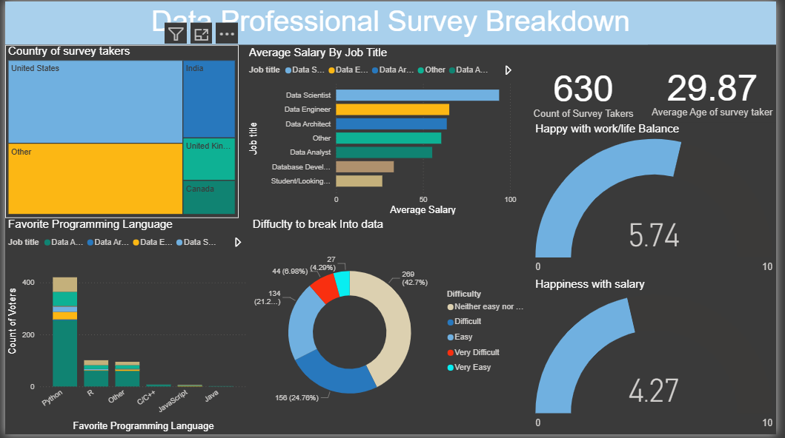

# Data Professional Survey – Power BI Dashboard

## Project Overview  
This project visualizes insights from a real survey of over 600 Data Analysts and Data Scientists conducted by Alex The Analyst. The goal was to explore job satisfaction, salaries, preferred programming languages, work-life balance, and other aspects of professional life across various countries.

## Objectives  
- Analyze salaries by job title for data professionals.  
- Understand work-life balance and happiness with salary among respondents.  
- Study difficulty levels for breaking into the data field.  
- Compare preferences for programming languages across job roles.  
- Visualize the distribution of survey participants across countries.  

## Data Preparation  
Data Source: Survey dataset (Excel file) with 600+ rows.  

Cleaning & Transformation:  
- Removed missing or inconsistent data values.  
- Standardized job titles and country names.  
- Created DAX measures for:  
  - Average salary by job title  
  - Happiness with work-life balance and salary  
  - Difficulty level distribution  

## Key Features & Insights  

### KPIs  
- Total Survey Takers: 630  
- Average Age of Survey Takers: 29.87  
- Work-life Balance Score: 5.74 (out of 10)  
- Salary Happiness Score: 4.27 (out of 10)  

### Visualizations  
- Tree Map: Survey takers by country (US, India, UK, Canada, others).  
- Bar Chart: Average salary by job title (Data Scientist, Data Engineer, etc.).  
- Donut Chart: Difficulty to break into data field (Very Easy, Easy, Difficult, etc.).  
- Bar Chart: Favorite programming languages across roles (Python, R, SQL, etc.).  
- Gauge Charts: Work-life balance and salary happiness scores.  

## Tools & Technologies  
- Power BI Desktop – Dashboard design and visualizations.  
- Power Query – Data cleaning and transformation.  
- DAX – Calculated measures for KPIs and insights.  

## Deliverables  
- Interactive Power BI dashboard (.pbix) built from the survey dataset (600+ rows).  
- Summary insights for data professionals by role, country, and experience.  
- Visual breakdown of programming preferences, salaries, and job satisfaction metrics.  

## Dashboard Preview  
  
